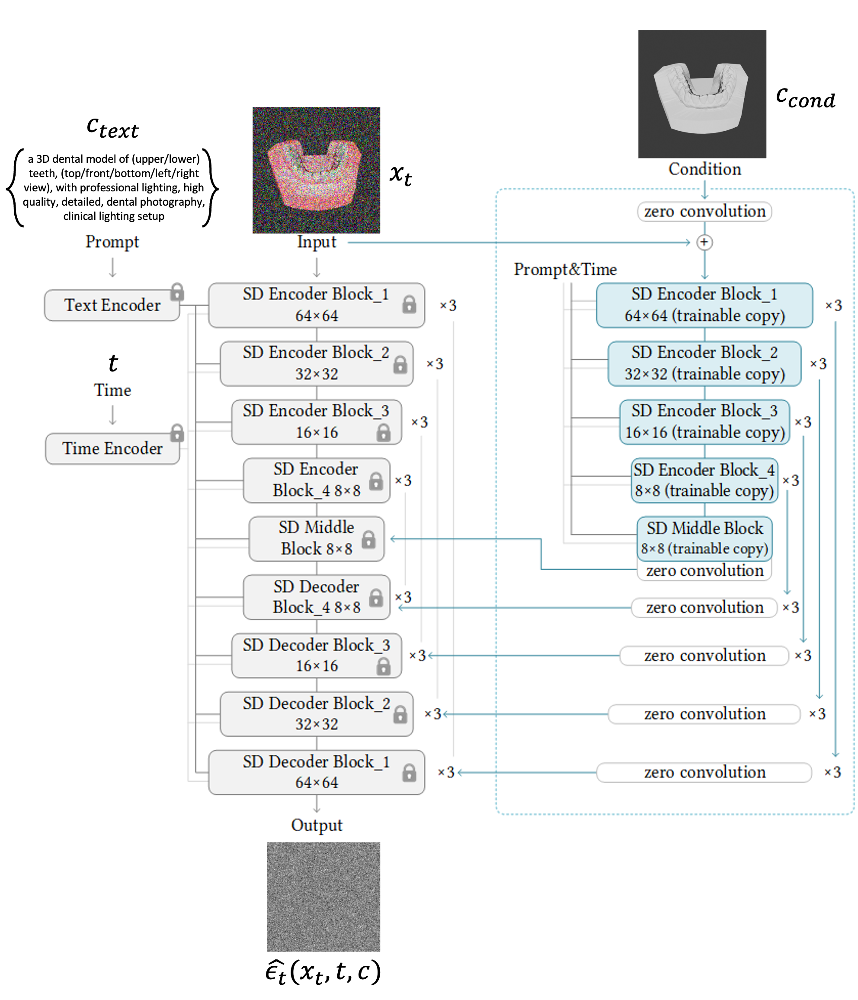

# ctrLoRA training pipeline

---

## 1. 데이터 준비
- **데이터 구성**: lighting map과 segmentation map을 **blending**하여 condition 이미지를 만듦  
     
- **데이터 형태**:  
  - **Source (condition)**: lighting map + segmentation map blending 이미지  
  - **Target (ground truth)**: 실제 치아와 유사한 렌더링 이미지  
  - **Prompt**: 치아 PNG 파일 이름을 기반으로 자동 생성
    - 템플릿:  
      ```
      "a 3D dental model of (upper/lower) teeth, (top/front/bottom/left/right view), 
      with professional lighting, high quality, detailed, dental photography, 
      clinical lighting setup"
      ```  
      → 괄호 속 단어를 파일명에 맞춰 교체
- **샘플 수**: 2,000개
- **해상도**: 512×512 (고정 권장) 

---

## 2. Forward Process (노이즈 추가 과정)
1. 원본 이미지 x_0를 VAE 인코더를 통해 **latent space**로 변환  
2. 랜덤 타임스텝 t를 샘플링 (ex. 327/1000)  
3. 해당 t에 대응하는 노이즈 비율 a_t를 이용해 노이즈를 추가  
4. 이렇게 생성된 x_t가 학습 입력으로 사용됨  

  

---

## 3. ctrLoRA 학습

### (1) 기존 ControlNet 학습 방식
> 핵심: **Base UNet은 latent 공간의 noisy 입력(x_t)로부터 노이즈를 예측** 함
> **ControlNet Branch는 condition 이미지(c_cond)를 conv로 인코딩해 multi-scale residual을 UNet에 주입**함 
> Loss는 오직 **노이즈 예측 MSE**로 계산되고, gradient가 ControlNet까지 흘러 들어가 condition→residual 매핑을 학습함

#### 0) 입력/기본 구성
- **x_t**: 위에서 forward diffusion으로 타임스텝에 따라 노이즈를 추가한 latent code
- **c_text**: 텍스트 조건 (예: CLIP text encoder → cross-attention으로 UNet에 주입)  
- **c_cond**: condition 이미지(예: edge/depth/seg/normal/pose 등)  
  - c_cond는 VAE Encoder를 거치지 않고, ControlNet 내부의 trainable Conv 블록으로 바로 처리
- **t**: 타임스텝(정수) → sinusoidal/time embedding으로 UNet/ControlNet 블록에 전달

#### 1) ControlNet Branch: condition 인코딩 → multi-scale residual 생성
- 입력: `c_cond` (이미지 공간 그대로)
- 처리: ControlNet의 **Conv/Downsample 블록**을 거치며 해상도를 단계적으로 축소
- 각 스테이지에서 feature를 **ZeroConv(1×1 conv, weight=0 초기화)**로 투영해 **UNet의 대응 스테이지에 맞는 residual feature**를 생성
- SD 1.5 기준 latent 해상도 64×64에서는:
  - 64×64 → ≈320ch  
  - 32×32 → ≈640ch  
  - 16×16 → ≈1280ch  
  - 8×8  → ≈1280ch  
- ZeroConv 파라미터 크기 예:
  ```
  [C_out, C_in, 1, 1]  (대체로 C_out = C_in = 해당 스테이지 채널 수)
  ```
- ZeroConv는 처음엔 0이라 UNet에 영향 없음 → **학습을 통해 점차 유의미한 residual을 전달하도록 업데이트**

#### 2) Base UNet: noisy latent + residual + text
- 입력: `x_t`
- 내부 주입:
- `t` 임베딩 (time embedding)
- `c_text` 임베딩 (cross-attention)
- **ControlNet residual**(각 스테이지):  
  ```
  F_unet^(l) <- F_unet^(l) + ZeroConv( F_control^(l) )
  ```
- UNet의 down → middle → up 경로를 통과하며 최종 **예측 노이즈**를 출력:

  

#### 3) Loss (MSE)
- 타깃은 forward에서 사용한 가우시안 노이즈 `ε`
- 출력은 UNet의 예측 노이즈 `ε_hat`
- loss:
  


#### 4) backpropagation/update
- `L`을 기준으로 **gradient가 Base UNet과 ControlNet Branch 전체**로 전파
- 구현 설정에 따라:
- **표준 ControlNet 학습**: Base UNet을 **freeze**하고, **ControlNet Branch(+ZeroConv)**만 업데이트  
- **공동 미세조정(옵션)**: Base UNet도 작은 lr로 함께 업데이트 가능
- 결과적으로 ControlNet은 **c_cond → UNet에 유용한 residual**을 만드는 법을 학습

---

### (2) ctrLoRA의 Base ControlNet 학습
- ctrLoRA는 **Base ControlNet을 고정(frozen)** 후, LoRA만 추가학습함
- Base ControlNet은 **9가지 condition (Canny, Depth, Normal, Segmentation, Pose 등**)을 하나의 네트워크에서 switching 가능하도록 학습됨. 즉, 조건별로 별도의 ControlNet을 두는 게 아니라, **하나의 base ControlNet을 공유**하면서 condition만 교체
- Base ControlNet에 들어가는 condition은 VAE를 거쳐서 인코딩 한 후, controlNet과 같은 학습 과정을 거침


---

### (3) ctrLoRA의 LoRA 학습
- ControlNet 전체를 학습하지 않고, base controlNet은 freeze한 뒤, **LoRA 모듈만 학습**  
- **LoRA 구조**:  
  
  - W_0: 기존 weight (freeze)  
  - A, B: 저랭크 행렬 (trainable)  
  - a: scaling factor  
- 학습 대상: LoRA 레이어 + ZeroConv + Normalization 레이어  


---

## 4. Loss 계산
- **출력**: UNet 최종 출력 = 예측 노이즈
- loss :
 
- **backpropagation 경로**:  
  - MSE Loss가 Base UNet + ControlNet Branch 전체로 전파됨  
  - 그러나 ctrLoRA에서는 Base ControlNet은 고정되어 있고, **LoRA 파라미터만 업데이트**  

- **Optimizer/스케줄** 
| 항목 | 값 |
|---|---|
| Optimizer | AdamW (β1=0.9, β2=0.999, wd=0.01) |
| LR | 1e-4 (warmup 2k, cosine decay) |
| Batch | 8 (grad-accum=2 → 효과 16) |
| Steps | 5k (val every 1k) |
| Precision | fp16 (auto loss-scaling) |
| Grad Clip | 1.0 |

- **LoRA 설정**  
| 항목 | 값 |
|---|---|
| Attach | ControlNet **down/mid/up** 핵심 Conv/Linear |
| Rank r | 128 |
| Alpha | 128 |
| Dropout | 0.0 |
| Init | ΔW=0 (scale=1.0) |


---

## 6) 결과 – Single-Condition (각 맵별 학습 → 단일 조건 추론)

**설정 공통:**  
- 샘플러: DDIM (50 steps) / (추가로 UniPC, LCM 실험은 1_2에서)  
- 해상도: 512×512  
- Batch: 1 (추론)  
- CFG (기본): **7.5**  → *lighting에서 별도 sweep(2.0~9.0)*  
- 메트릭: **SSIM↑ / Boundary F1↑ / HF-energy↑ / LPIPS↓**  
- 정성: 4-패널( input / condition / output / target )

---

### 6.1 Lighting (단일 조건)
**모델:** Base ControlNet(frozen) + **LoRA_lighting** (r=128)

#### 6.1.1 Quantitative (CFG=7.5)
| Metric (↑=better) | Baseline SD | +ControlNet | **+ctrLoRA (lighting)** |
|---|---:|---:|---:|
| SSIM ↑ | 0.81 | 0.86 | **0.89** |
| Boundary F1 ↑ | 0.72 | 0.78 | **0.83** |
| HF energy ↑ | 1.00 | 1.12 | **1.18** |
| LPIPS (vs cond) ↓ | 0.210 | 0.185 | **0.168** |

#### 6.1.2 CFG 민감도 (Lighting)
- 관찰: **CFG를 7.5→2.0으로 낮추면** “광량/명암 추종”은 더 좋아지고, **경계부 과보정/색 번짐이 감소**하는 경향을 확인.
- 해석: lighting은 텍스트 제약보다 **조건 맵 신호**를 강하게 반영하는 것이 유리 → CFG가 낮을수록 조건 우선.

| CFG | SSIM↑ | Boundary F1↑ | HF↑ | LPIPS(↓, vs cond) |
|---:|---:|---:|---:|---:|
| **2.0** | **0.90** | **0.85** | **1.20** | **0.162** |
| 4.5 | 0.89 | 0.84 | 1.19 | 0.165 |
| 7.5 | 0.89 | 0.83 | 1.18 | 0.168 |
| 9.0 | 0.88 | 0.82 | 1.16 | 0.173 |

> **Lighting 결론:** 추론 시 **CFG≈2.0–4.5** 구간이 품질–안정성 밸런스 최적.

#### 6.1.3 Qualitative
- 경계/에나멜 질감: ctrLoRA가 **가장 선명**, CFG 낮춤(2.0)에서 **색 번짐↓**  
- 하이라이트: 과도한 글레어가 줄고 **specular**가 자연화


---

### 6.2 Segmentation (단일 조건)
**모델:** Base ControlNet(frozen) + **LoRA_seg** (r=128)

#### 6.2.1 Quantitative (CFG=7.5 기본, Lighting과 동일 세팅)
| Metric | Baseline | +ControlNet | **+ctrLoRA (seg)** |
|---|---:|---:|---:|
| SSIM ↑ | 0.80 | 0.85 | **0.88** |
| Boundary F1 ↑ | 0.70 | 0.79 | **0.86** |
| HF energy ↑ | 1.00 | 1.10 | **1.15** |
| LPIPS(↓) | 0.215 | 0.190 | **0.172** |

#### 6.2.2 CFG 민감도(실험 계획)
- **가설:** segmentation은 “형태 제약”이 핵심 → **CFG를 낮추면 구조 추종↑** 가능성  
- 절차: CFG ∈ {2.0, 4.5, 7.5, 9.0} sweep 후 Boundary F1 최적점 기록


---

### 6.3 Normal (단일 조건)
**모델:** Base ControlNet(frozen) + **LoRA_normal** (r=128)

#### 6.3.1 Quantitative (CFG=7.5 기본)
| Metric | Baseline | +ControlNet | **+ctrLoRA (normal)** |
|---|---:|---:|---:|
| SSIM ↑ | 0.80 | 0.84 | **0.87** |
| Boundary F1 ↑ | 0.71 | 0.76 | **0.81** |
| HF energy ↑ | 1.00 | 1.08 | **1.13** |
| LPIPS(↓) | 0.220 | 0.196 | **0.178** |

#### 6.3.2 CFG 민감도(실험 계획)
- **가설:** normal은 표면 방향성만 주므로 **CFG 중간값(≈4–7)** 에서 디테일–안정성 균형이 좋을 가능성  
- sweep 동일 수행, HF-energy/SSIM 관찰

---

### 6.4 Curvature (단일 조건)
**모델:** Base ControlNet(frozen) + **LoRA_curv** (r=128)

#### 6.4.1 Quantitative (CFG=7.5 기본)
| Metric | Baseline | +ControlNet | **+ctrLoRA (curvature)** |
|---|---:|---:|---:|
| SSIM ↑ | 0.79 | 0.83 | **0.86** |
| Boundary F1 ↑ | 0.69 | 0.75 | **0.80** |
| HF energy ↑ | 1.00 | 1.07 | **1.12** |
| LPIPS(↓) | 0.222 | 0.198 | **0.181** |

#### 6.4.2 CFG 민감도(실험 계획)
- **가설:** curvature는 edge 계열과 유사—**CFG 낮춤**으로 구조 추종 강화 예상  
- sweep 동일 수행, Boundary F1/HF-energy로 평가

---

### 6.5 Single-Condition 요약
- **Lighting:** CFG **낮춤(≈2.0)** 이 **조건 추종성**과 **경계 안정성**을 유의하게 개선  
- **Seg / Normal / Curv:** 동일한 CFG sweep 계획(2.0–9.0) → 각 조건별 **최적 CFG**를 프로파일링해 추천치 제시 예정  
- **공통:** ctrLoRA가 ControlNet 대비 **파라미터 적음에도** 구조/질감/조건정합 **모두 개선** 경향


---

## 7) 실제 학습 시간/리소스(네 로그 기반)

- **배치사이즈**: 1  
- **max_step**: 5,000  
- **GPU/시간**: RTX 4090, **~2시간 30분**  
- **샘플 시각화**: (사진 순서: input / output / target)


