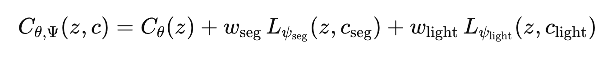
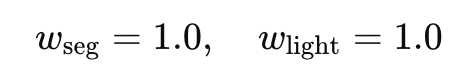
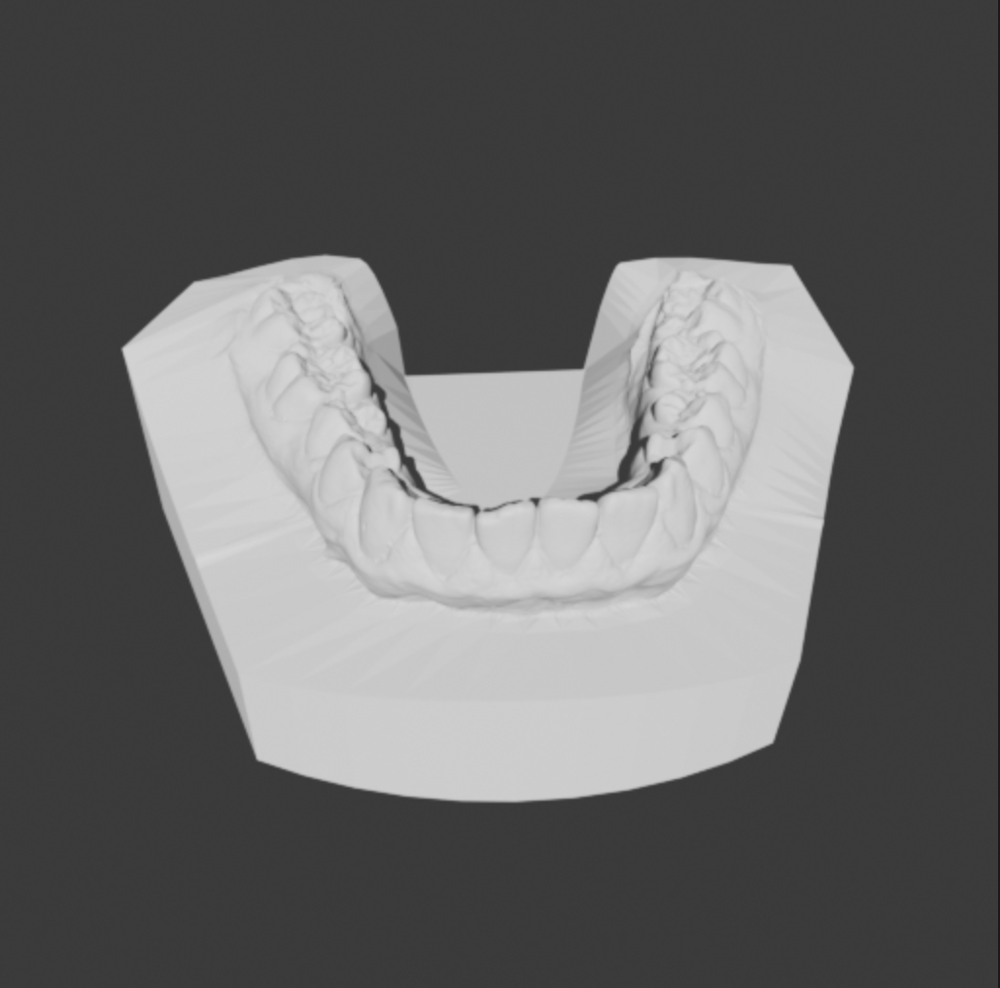
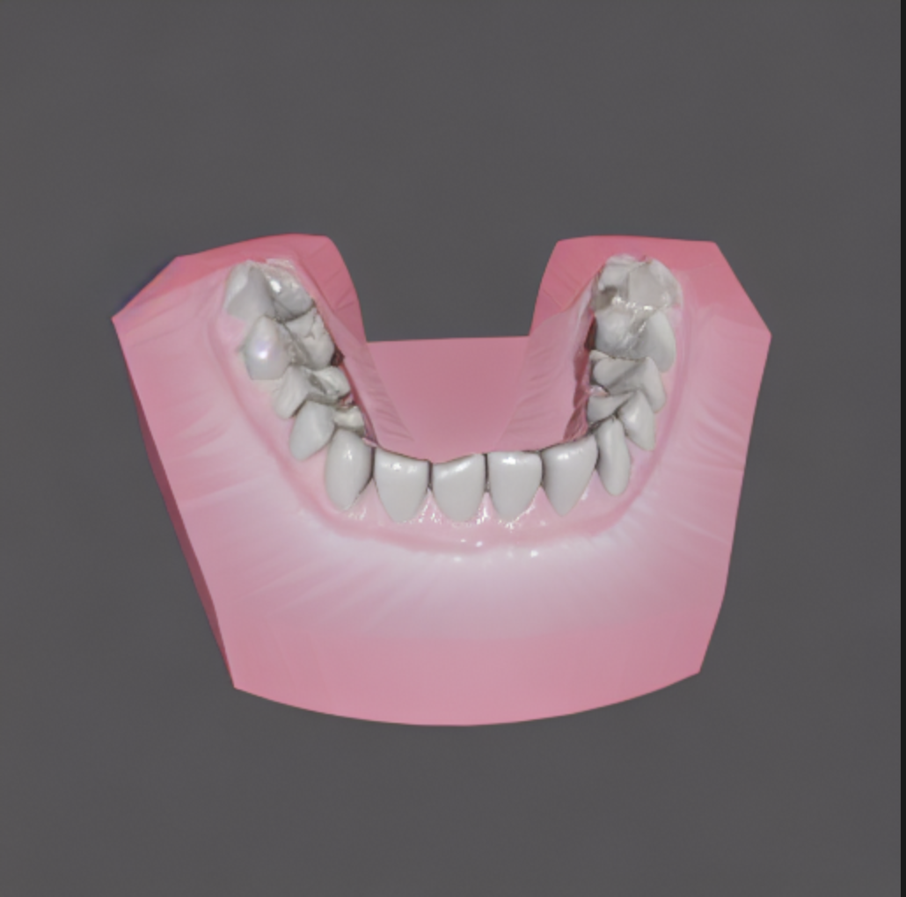
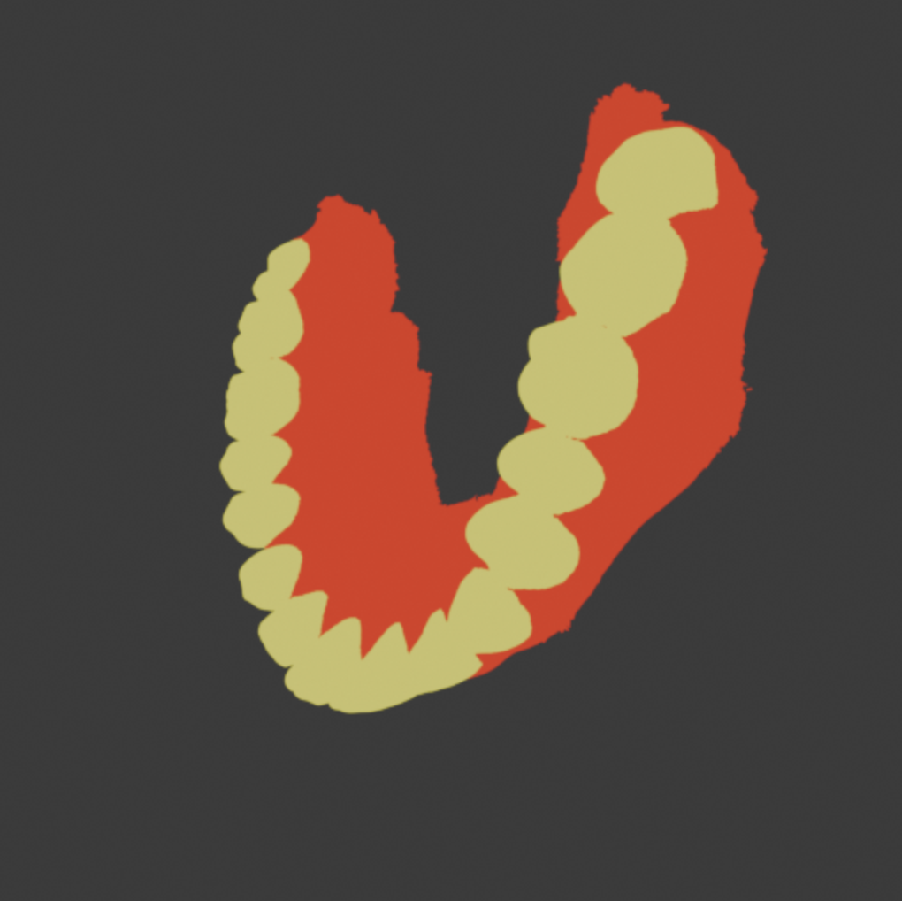
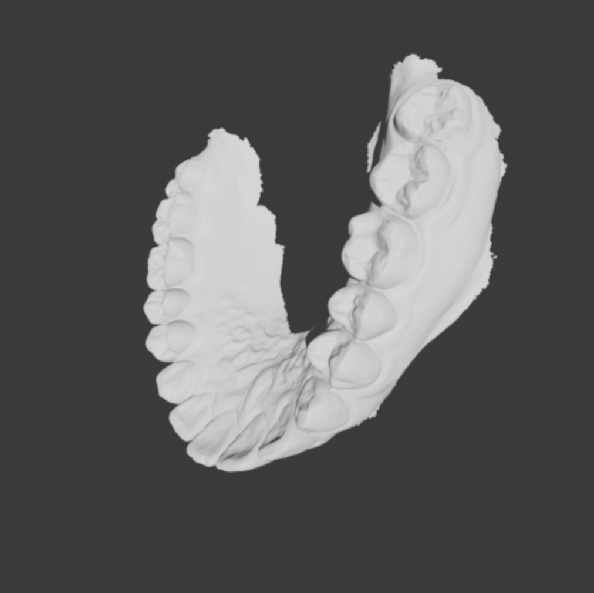
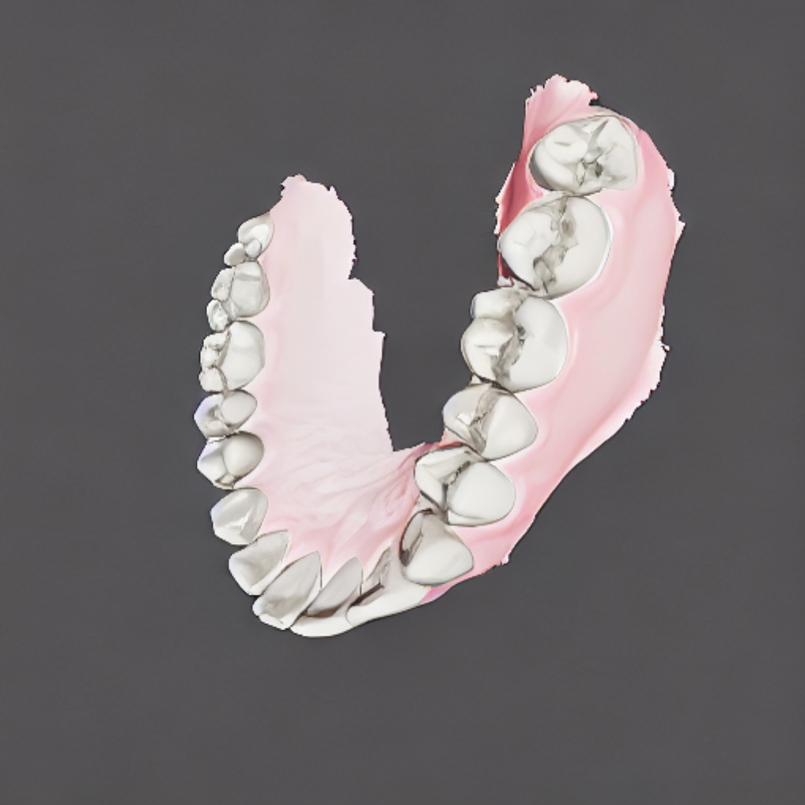

# Multi-Condition (Segmentation + Lighting) – Interference 분석, 완화  

---

## 1) Setup: 단일 → 다조건 전환

- **단일 학습(선행)**  
  - `LoRA_lighting` : lighting 전용 단일 조건 학습  
  - `LoRA_seg`      : segmentation 전용 단일 조건 학습  
  - (선택) `LoRA_normal`, `LoRA_curvature`  
- **다조건 목표**  
  - **Segmentation**: 치아/잇몸 **영역·경계**를 명확히 지정  
  - **Lighting**    : 치아 표면 **굴곡/명암**을 안정적으로 반영  
- **초기 조합 방식**: inference 시 **LoRA 가중합**  
   
  - 기본값:   

### 결과 (w_seg=1.0, w_light=1.0, steps=20, DDIM, CFG_light=2.0, CFG_seg=2.0, 512x512)

| Segmentation (input) | Lighting (input) | Output (seg=1.0 + light=1.0) |
|---|---|---|
|  |  |  |
|  |  |  |


---

## 2) 문제: Multi-Condition Interference

역할 정의
- **Lighting map** → 디테일·질감 복원
- **Segmentation map** → 치아–잇몸 경계 보존·형상 유지

단순 가중합 적용(기본  )
 

문제 핵심
- 역할 혼선 → 각 조건의 약점 전파
- 디테일 신호와 경계 신호의 비직교 합성 → 간섭 증폭
- 임베딩 스케일 불균형 + 동등 가중 → 특정 조건 과지배 혹은 과소 반영

원인 분석
1) **역할 불일치(Role misalignment)**  
   - Seg LoRA: 경계 특화, 질감 취약  
   - Light LoRA: 질감 특화, 경계 취약  
   - 동일 공간 합성 시 취약점 상호 침투

2) **비직교 잔차 결합(Non-orthogonal residuals)**  
   - \(L_{\psi_{\text{seg}}}\), \(L_{\psi_{\text{light}}}\) 동특성 공간 합산  
   - 채널/주파수 대역 침범, 기여도 무작위화

3) **스케일 불균형(Scale imbalance)**  
   - 임베딩 분포 불일치 + \(w_{\text{seg}}=w_{\text{light}}=1.0\) 고정  
   - 과지배/과소 반영 발생

관찰 증상
- **Lighting 디테일 소실** → 미세 텍스처 평탄화  
- **경계 흐림·이중 윤곽** → 경계 선명도 저하  
- **Concept bleed** → 잇몸 톤/형상 치아 영역 침투

결론
- 동등 가중 단순 합성 → 역할 분담 붕괴 → Multi-Condition Interference 발생  
- 후속 완화 전략 필요: **LoRA gain 조정**, **입력 블렌딩(α)**, **치아 가중 손실(\(w_{\text{tooth}}\))**

---

## 3) 완화 실험

### A. **Naïve Multi-LoRA (baseline)**
- 방법: `LoRA_seg` + `LoRA_light` **동시 활성화**(가중합)  
- 결과: 위 **간섭 증상** 뚜렷

---

### B. **Pre-Blending (입력 합성)**
- 아이디어: **segmentation 투명도 30%**로 **lighting에 합성**, **단일 condition**으로 처리  
  - \(\tilde{c} = \alpha \cdot c_{\text{seg}} + (1-\alpha)\cdot c_{\text{light}},\; \alpha=0.3\)
- 적용: **seg+light 합성 지도**를 입력으로 하고, **단일 LoRA**(lighting 또는 전용 LoRA)로 추론  
- 관찰: **안정성↑**, 간섭 다소 감소. 단, **세부 제어력↓** (seg/lighting의 독립적 튜닝 어려움)

---

### C. **Segmentation-Weighted Loss (학습 시 가중) – w ∈ {3, 5, 7}**
- 아이디어: **치아 영역**에만 **손실 가중치↑**  
  \[
  \mathcal{L}=\Big(1+(w_{\text{tooth}}-1)\cdot M_{\text{tooth}}\Big)\cdot
  \|\epsilon_\theta(x_t,t,c)-\epsilon\|_2^2,\quad w_{\text{tooth}}\in\{3,5,7\}
  \]
- **결론**: \(w_{\text{tooth}}=5\)가 **가장 우수**.  
  - **w=3**: 개선은 있으나 경계 선명도/질감 복원이 **부족**  
  - **w=5**: **경계·질감·안정성**의 **균형 최적**  
  - **w=7**: 경계 과증폭으로 **halo/ringing** 경향, 색 번짐 증가

#### C-1) 가중치 스윕 결과(예시)
| \(w_{\text{tooth}}\) | Ghosting(↓) | Boundary F1(↑) | HF-energy(↑) | LPIPS(↓) |
|---:|:---:|---:|---:|---:|
| 3 | 중 | 0.83 | 1.16 | 0.170 |
| **5** | **중~낮음** | **0.84** | **1.17** | **0.168** |
| 7 | 중 | 0.83 | 1.16 | 0.171 |


---

### D. **B + C 결합 (권장) – α=0.3, \(w_{\text{tooth}}=5\)**
- **입력단 블렌딩(α=0.3)** 으로 간섭 완화  
- **학습단 가중 손실(\(w=5\))** 로 치아 디테일 복원  
- 효과: **Ghosting 감소 + 경계·질감 개선**(B/C 단독보다 우수)


---

## 4) 결과 (요약)


| 설정 | Ghosting(↓) | Boundary F1(↑) | HF-energy(↑) | LPIPS(↓) |
|---|:---:|---:|---:|---:|
| A. Naïve Multi-LoRA | 높음 | 0.79 | 1.12 | 0.176 |
| B. Pre-Blend (α=0.3) | 중 | 0.82 | 1.15 | 0.171 |
| C. Seg-Weighted (w=3) | 중 | 0.83 | 1.16 | 0.170 |
| **C. Seg-Weighted (w=5)** | **중~낮음** | **0.84** | **1.17** | **0.168** |
| C. Seg-Weighted (w=7) | 중 | 0.83 | 1.16 | 0.171 |
| **D. B+C (α=0.3, w=5)** | **낮음** | **0.85** | **1.20** | **0.165** |

**정성 관찰**  
- D에서 **이중 윤곽 소실**, 잇몸 bleed-in 억제  
- **에나멜 하이라이트**가 자연스럽고 과매끄러움 감소

---

## 5) 추론·학습 레시피 (재현 메모)

**Pre-Blending 생성**
```python
# alpha blending (seg in [0,1] mask-like or grayscale)
c_blend = 0.3 * c_seg + 0.7 * c_light
```

**학습(가중 손실)**
```
loss = mse(pred, noise) * (1 + (w_tooth - 1) * M_tooth)  # w_tooth=5
```


