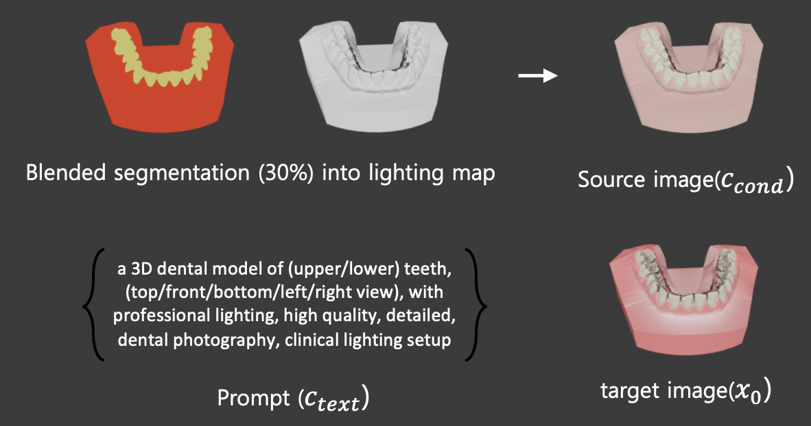
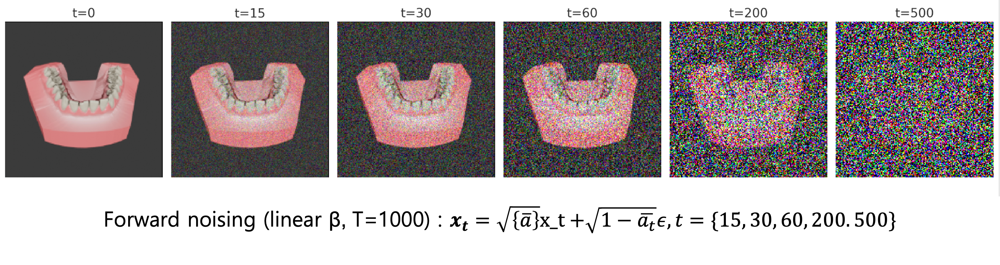
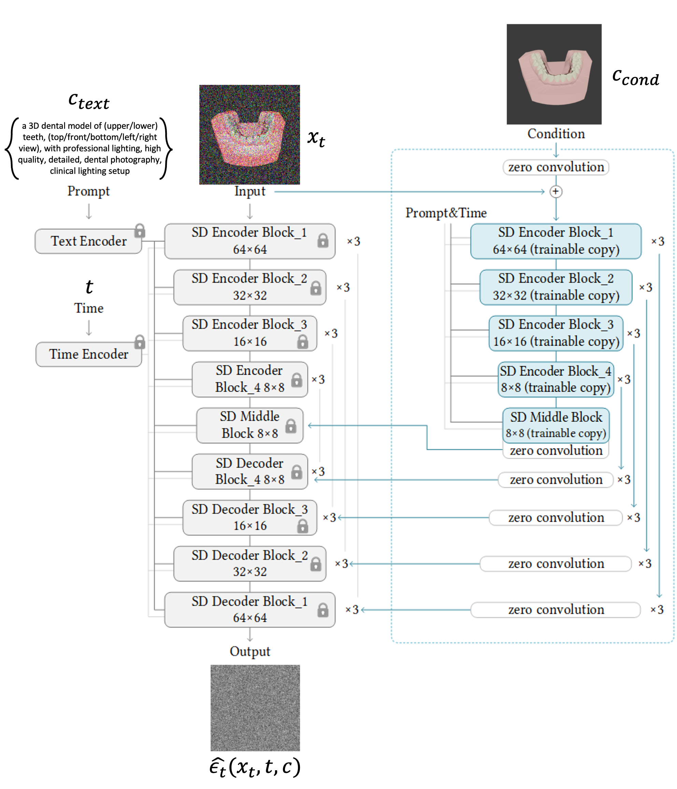
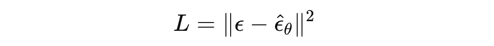
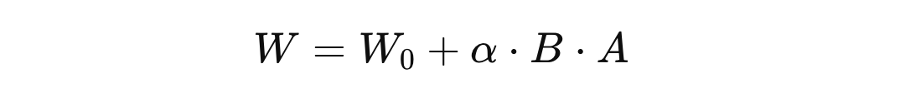
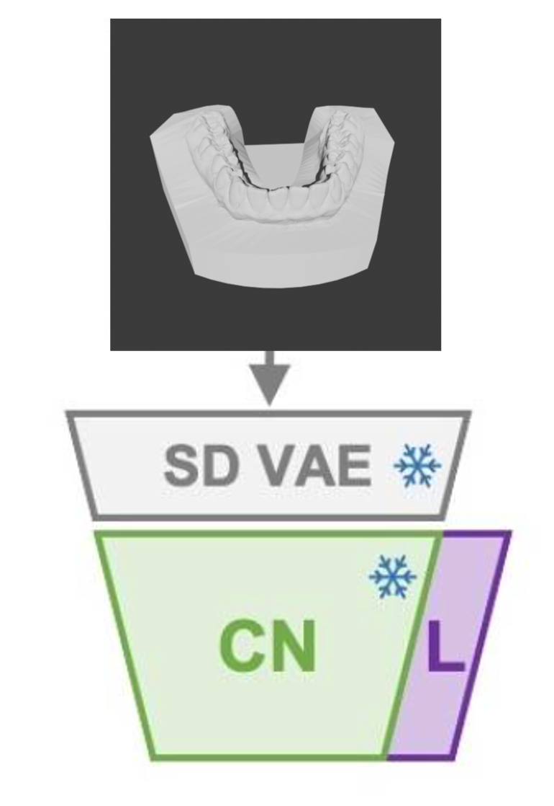

# ctrLoRA training pipeline

---

## 1. 데이터 준비
- **데이터 구성**: lighting map과 segmentation map을 **blending**하여 condition 이미지를 만듦  
     
- **데이터 형태**:  
  - **Source (condition)**: lighting map + segmentation map blending 이미지  
  - **Target (ground truth)**: 실제 치아와 유사한 렌더링 이미지  
  - **Prompt**: 치아 PNG 파일 이름을 기반으로 자동 생성
    - 템플릿:  
      ```
      "a 3D dental model of (upper/lower) teeth, (top/front/bottom/left/right view), 
      with professional lighting, high quality, detailed, dental photography, 
      clinical lighting setup"
      ```  
      → 괄호 속 단어를 파일명에 맞춰 교체
- **샘플 수**: 2,000개 

---

## 2. Forward Process (노이즈 추가 과정)
1. 원본 이미지 x_0를 VAE 인코더를 통해 **latent space**로 변환  
2. 랜덤 타임스텝 t를 샘플링 (ex. 327/1000)  
3. 해당 t에 대응하는 노이즈 비율 a_t를 이용해 노이즈를 추가  
4. 이렇게 생성된 x_t가 학습 입력으로 사용됨  

  

---

## 3. ctrLoRA 학습

### (1) 기존 ControlNet 학습 방식
> 핵심: **Base UNet은 latent 공간의 noisy 입력(x_t)로부터 노이즈를 예측** 함
> **ControlNet Branch는 condition 이미지(c_cond)를 conv로 인코딩해 multi-scale residual을 UNet에 주입**함 
> Loss는 오직 **노이즈 예측 MSE**로 계산되고, gradient가 ControlNet까지 흘러 들어가 condition→residual 매핑을 학습함

#### 0) 입력/기본 구성
- **x_t**: 위에서 forward diffusion으로 타임스텝에 따라 노이즈를 추가한 latent code
- **c_text**: 텍스트 조건 (예: CLIP text encoder → cross-attention으로 UNet에 주입)  
- **c_cond**: condition 이미지(예: edge/depth/seg/normal/pose 등)  
  - c_cond는 VAE Encoder를 거치지 않고, ControlNet 내부의 trainable Conv 블록으로 바로 처리
- **t**: 타임스텝(정수) → sinusoidal/time embedding으로 UNet/ControlNet 블록에 전달

#### 1) ControlNet Branch: condition 인코딩 → multi-scale residual 생성
- 입력: `c_cond` (이미지 공간 그대로)
- 처리: ControlNet의 **Conv/Downsample 블록**을 거치며 해상도를 단계적으로 축소
- 각 스테이지에서 feature를 **ZeroConv(1×1 conv, weight=0 초기화)**로 투영해 **UNet의 대응 스테이지에 맞는 residual feature**를 생성
- SD 1.5 기준 latent 해상도 64×64에서는:
  - 64×64 → ~320ch
  - 32×32 → ~640ch
  - 16×16 → ~1280ch
  - 8×8  → ~1280ch
- ZeroConv 파라미터 크기 예:
  ```
  [C_out, C_in, 1, 1]  (대체로 C_out = C_in = 해당 스테이지 채널 수)
  ```
- ZeroConv는 처음엔 0이라 UNet에 영향 없음 → **학습을 통해 점차 유의미한 residual을 전달하도록 업데이트**

#### 2) Base UNet: noisy latent 처리 + residual 주입 + 텍스트 조건
- 입력: `x_t`
- 내부 주입:
- `t` 임베딩 (time embedding)
- `c_text` 임베딩 (cross-attention)
- **ControlNet residual**(각 스테이지):  
  ```
  F_unet^(l) <- F_unet^(l) + ZeroConv( F_control^(l) )
  ```
- UNet의 down → middle → up 경로를 통과하며 최종 **예측 노이즈**를 출력:

  

#### 3) Loss (MSE)
- 타깃은 forward에서 사용한 가우시안 노이즈 `ε`
- 출력은 UNet의 예측 노이즈 `ε_hat`
- loss:
  


#### 4) backpropagation/update
- `L`을 기준으로 **gradient가 Base UNet과 ControlNet Branch 전체**로 전파
- 구현 설정에 따라:
- **표준 ControlNet 학습**: Base UNet을 **freeze**하고, **ControlNet Branch(+ZeroConv)**만 업데이트  
- **공동 미세조정(옵션)**: Base UNet도 작은 lr로 함께 업데이트 가능
- 결과적으로 ControlNet은 **c_cond → UNet에 유용한 residual**을 만드는 법을 학습

---

### (2) ctrLoRA의 Base ControlNet 학습
- ctrLoRA는 **Base ControlNet을 고정(frozen)** 후, LoRA만 추가학습함
- Base ControlNet은 **9가지 condition (Canny, Depth, Normal, Segmentation, Pose 등**)을 하나의 네트워크에서 switching 가능하도록 학습됨. 즉, 조건별로 별도의 ControlNet을 두는 게 아니라, **하나의 base ControlNet을 공유**하면서 condition만 교체
- Base ControlNet에 들어가는 condition은 VAE를 거쳐서 인코딩 한 후, controlNet과 같은 학습 과정을 거침


---

### (3) ctrLoRA의 LoRA 학습
- ControlNet 전체를 학습하지 않고, base controlNet은 freeze한 뒤, **LoRA 모듈만 학습**  
- **LoRA 구조**:  
  
  - W_0: 기존 weight (freeze)  
  - A, B: 저랭크 행렬 (trainable)  
  - a: scaling factor  
- 학습 대상: LoRA 레이어 + ZeroConv + Normalization 레이어  


---

## 4. Loss 계산
- **출력**: UNet 최종 출력 = 예측 노이즈
- loss :
 
- **backpropagation 경로**:  
  - MSE Loss가 Base UNet + ControlNet Branch 전체로 전파됨  
  - 그러나 ctrLoRA에서는 Base ControlNet은 고정되어 있고, **LoRA 파라미터만 업데이트**  

---


# ctrLoRA training result


배치사이즈1, max_step 5000으로 학습 진행
RTX 4090기준 약 2시간 30분 소요
사진 순서는 모두 (input / ouput / target)

## 1. 단일 condition
- Lighting map만 학습 → inference 시 전체 조명 특성은 잘 반영되었으나, 치아의 세부 구조는 부족
- Segmentation map만 학습 → 구조적 디테일은 살아나지만, 조명과 질감 표현이 불안정


## (2) 다중 condition
- Lighting + Segmentation 두 condition을 **동시에 입력하여 inference**
- 문제: multi-condition interference 발생
  - 구조를 더 잘표현하는 Segmentation map과 디테일을 더 잘 복원하는 lighting map 정보가 서로 간섭
  → 결과 이미지가 불안정하거나 artifact 발생  

## (3) Blending 방식
- Lighting map과 Segmentation map을 사전에 **blending하여 하나의 condition 이미지**로 통합
- 이렇게 만든 blended condition을 input으로 학습 진행

- multi-condition interference 완화
- 구조적 디테일(치아)과 lighting 특성이 모두 안정적으로 반영됨
- 하지만, 치아 부분의 디테일 손상 여전히 발생


