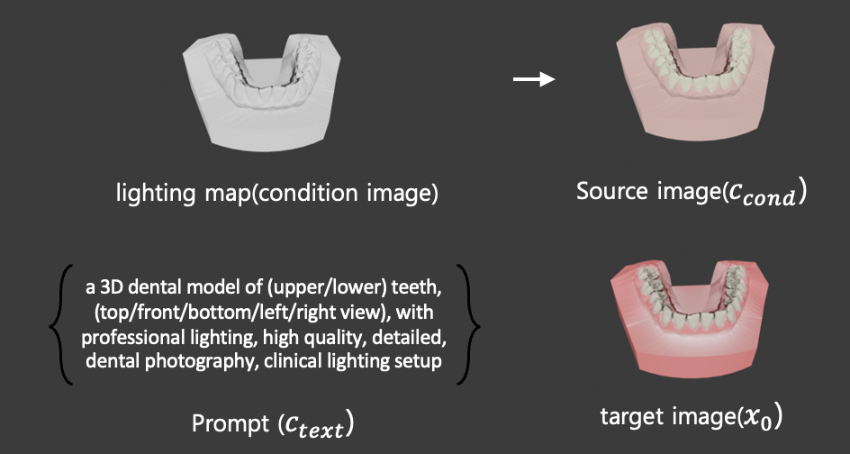

# 📘 ctrLoRA 학습 파이프라인

---

## 1. 데이터 준비
- **데이터 구성**: lighting map과 segmentation map을 **blending**하여 condition 이미지를 만듦  
    
- **샘플 수**: 2,000개  
- **데이터 형태**:  
  - **Source (condition)**: lighting map + segmentation map blending 이미지  
  - **Target (ground truth)**: 실제 치아와 유사한 렌더링 이미지  
  - **Prompt**: 치아 PNG 파일 이름을 기반으로 자동 생성  
    - 템플릿:  
      ```
      "a 3D dental model of (upper/lower) teeth, (top/front/bottom/left/right view), 
      with professional lighting, high quality, detailed, dental photography, 
      clinical lighting setup"
      ```  
      → 괄호 속 단어를 파일명에 맞춰 교체  

---

## 2. Forward Process (노이즈 추가 과정)
1. 원본 이미지 x_0를 VAE 인코더를 통해 **latent space**로 변환  
2. 랜덤 타임스텝 t를 샘플링 (ex. 327/1000)  
3. 해당 t에 대응하는 노이즈 비율 a_t를 이용해 노이즈를 추가  
4. 이렇게 생성된 x_t가 학습 입력으로 사용됨  

  

---

## 3. ctrLoRA 학습

### (1) 기존 ControlNet 학습 방식
- **Base 구조**: Stable Diffusion의 Base UNet + ControlNet Branch  
- **Base UNet**: 텍스트 조건 c_text만으로 이미지 생성  
- **ControlNet Branch**:  
  - Condition image(hint, edge/depth/seg 등)를 입력받음  
  - Conv 블록으로 인코딩
  - Base UNet의 대응 블록 feature에 **residual connection**으로 주입  
  - ZeroConv로 초기화되어 처음엔 영향 없음 → 학습이 진행되면서 유의미한 residual 제공

  

---

### (2) ctrLoRA의 Base ControlNet  
- ctrLoRA는 **Base ControlNet을 고정(frozen)**  
- Base ControlNet은 **9가지 condition (Canny, Depth, Normal, Segmentation, Pose 등)**을 하나의 네트워크에서 switching 가능하도록 학습됨  
- 즉, 조건별로 별도의 ControlNet을 두는 게 아니라, **하나의 base ControlNet을 공유**하면서 condition만 교체  

---

### (3) ctrLoRA의 LoRA 학습
- ControlNet 전체를 학습하지 않고, **LoRA 모듈만 학습**  
- **LoRA 구조**:  
  $$$
  W = W_0 + \alpha \cdot B \cdot A
  $$$ 
  - \(W_0\): 기존 weight (freeze)  
  - \(A, B\): 저랭크 행렬 (trainable)  
  - \(\alpha\): scaling factor  
- 학습 대상: LoRA 레이어 + ZeroConv + Normalization 레이어  
- 장점: 파라미터 효율적, 다양한 condition 별 LoRA를 교체/조합 가능  

---

## 4. Loss 계산
- **출력**: UNet 최종 출력 = 예측 노이즈 \(\hat{\epsilon}_\theta(x_t, t, c)\)  
- **Loss**:  
  \[
  L = \|\epsilon - \hat{\epsilon}_\theta\|^2
  \]  
- **역전파 경로**:  
  - MSE Loss가 Base UNet + ControlNet Branch 전체로 전파됨  
  - 그러나 Base ControlNet은 고정되어 있고, **LoRA 파라미터만 업데이트**  
- **Classifier-free guidance**: 일정 확률(drop_rate)로 텍스트 조건을 제거하여, guidance 강도를 학습  

---

## ✅ 정리
- **ctrLoRA는 Base ControlNet을 freeze한 상태에서 LoRA 모듈만 학습**  
- Base ControlNet은 다중 condition switching을 지원하며, LoRA는 condition-specific residual을 학습  
- Loss는 기존 diffusion과 동일하게 **노이즈 예측 MSE**  
- 결과적으로 파라미터 효율이 높고, 조건별 제어 성능을 유지하면서도 빠르게 학습 가능  
