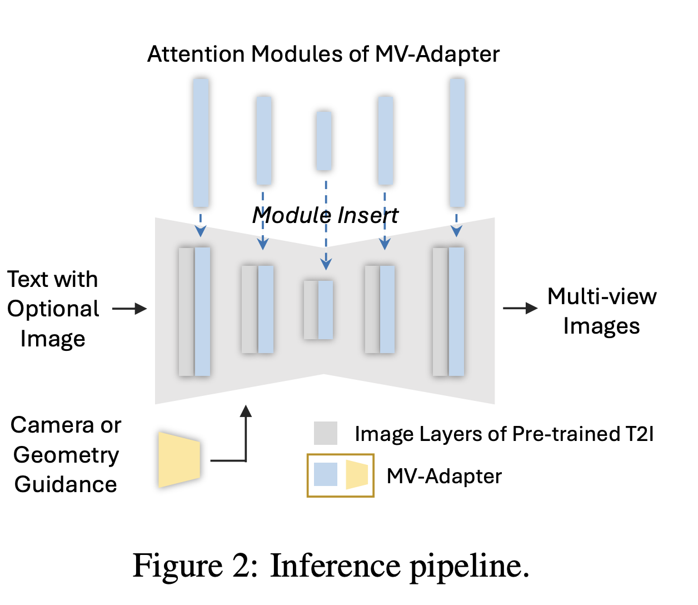
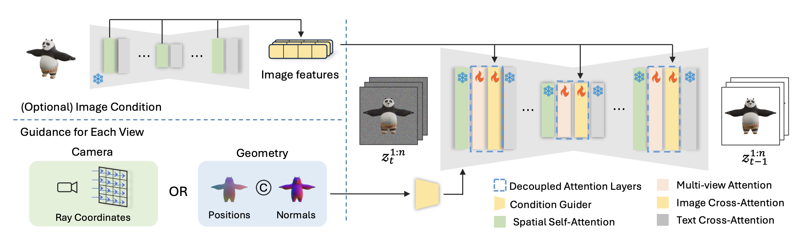
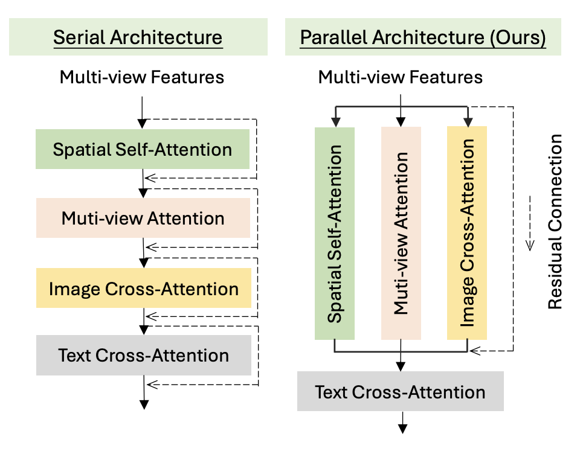

# MV-Adapter: Multi-view Consistent Image Generation Made Easy

---

## 1. Motivation
기존 multi-view diffusion 모델들은 대부분 **입력 이미지로부터 3D geometry를 추론**하고,  
그 결과로 multi-view 이미지를 생성하는 **bottom-up pipeline**을 사용

**MV-Adapter**는 **mesh → image 방향(top-down**) 접근을 취하며,  
**reference image와 명시적인 3D geometry condition (position, normal, raymap**)을 함께 사용하여  
multi-view 전반에서 **reference image의 시각적 일관성(visual consistency**)을 유지  

---

## 2. Mechanism

MV-Adapter는 기존 **Stable Diffusion (SD2.1 / SDXL)** 구조를 변경하지 않고,  
**multi-view consistency**를 학습하기 위한 모듈(adapter)만 추가하는 방식으로 동작함 
 

핵심은 다음 두 가지 구성 요소로 이뤄짐

1. **Condition Guider** – 카메라/지오메트리 조건을 인코딩하여 UNet 내부에 주입  
2. **Decoupled Attention Layers** – 기존 attention 구조를 병렬화(parallelization)하여  
   multi-view, image, text 정보를 동시에 처리
 

---

### 2.1 Condition Guider

Condition Guider는 각 시점(view)에 대한 **Camera condition** 또는  
**Geometry condition**를 feature map으로 변환해  
UNet의 여러 스케일(feature scale)에 주입하는 역할  

#### 입력
- **Camera ray map (Raymap)**  
  - 각 픽셀의 ray direction과 ray origin을 나타내는 6채널 맵  
  - 카메라의 **intrinsic/extrinsic matrix**를 이용해 3D→2D로 투사 시 계산  
- **Geometry condition (Position + Normal maps)**  
  - mesh 표면에서 렌더링된 3D Position과 Normal  
  - 픽셀 단위로 object surface의 공간적 대응관계 제공

> 코드에서는 mesh에서 Camera ray map과 Geometry condition를 직접 뽑아냄

#### 역할
- 입력 조건 (Camera ray map, Geometry condition)을  
  convolutional block을 통해 multi-scale feature로 변환  
- 각 scale의 feature를 **UNet encoder의 대응되는 계층에 더함 (additive injection**)  
- 이로써 모델은 각 view의 공간적 배치와 표면 방향을 인식  

- Condition Guider의 convolutional encoder는  
  입력 condition을 **U-Net encoder의 각 downsampling block 해상도에 맞춰**  
  multi-scale feature로 인코딩하고,  
  이를 해당 scale의 feature에 **additive로 주입**.  
  이 과정을 통해 geometry 정보가 U-Net의 모든 인코딩 단계에 통합됨.  

> 즉, Condition Guider는 **“geometry-aware feature conditioning layer”**로,  
> multi-view consistency를 위한 명시적 구조 정보를 UNet feature space에 통합함

---

### 2.2 Decoupled Attention Layers

MV-Adapter의 핵심은 **기존 self-attention 구조를 duplicate하고 parallelize** 하는 것

#### 구성 요소
 

| Type | Query | Key/Value | 목적 |
|------|--------|------------|------|
| Spatial Self-Attn | 현재 view latent | Text embedding | 현재 view feature |
| Multi-view Attn | 현재 view latent | 다른 view latent | 3D 구조 일관성 |
| Image Cross-Attn | 현재 view latent | Reference image latent | 시각적 스타일 일관성 |
| Text Cross-Attn | (Self + Multi-View + Image Cross)의 합산 feature | CLIP text embedding | 의미 반영 |  

  
Spatial Self-Attention, Text Cross-Attention은 기존 stable diffusion UNet의 기본 블록이며,  
Multi-View Attention, Image Cross-Attention은 Spatial Self-Attention 블록을 복제한 구조의 블록  

#### Parallel Architecture

기존 Stable Diffusion의 attention은 **serial residual connection** 구조로 되어 있지만,  
MV-Adapter는 이를 **parallel residual structure**로 변경  

- 기존 Stable Diffusion의 UNet에서 나온 latent feature를 모든 attention 블록(Self, Multi-view, Image Cross, Text Cross)이 동시에 공유하므로,  
  기존 pretrained weight 그대로 활용 가능  
- 학습시, 추가한 attention layer의 **output projection을 0으로 초기화(zero-init)** →  
  controlNet 학습처럼 초기에 기존 모델의 feature space를 전혀 교란하지 않음  
- Multi-view와 Image cross-attention이 각각 Multi-View Attention, Image Cross-Attention에서 학습되면서  
  점진적으로 geometry-aware consistency를 학습함

> 이 병렬 구조는 pretrained prior를 유지하면서  
> **새로운 3D geometric prior**를 효율적으로 흡수할 수 있도록 설계됨

---

### 2.3 Training

학습 시에는 **기존 Stable Diffusion과 동일한 noise prediction loss (ε-MSE**)를 사용하되,  
MV-Adapter의 파라미터만 업데이트함

---

### 2.4 Inference Pipeline

추론 시에는 다음 순서로 작동  

1. Text prompt, reference image, camera/geometry map 입력  
- image reference
   - vae로 latent 생성
   - time step을 0으로 설정(noise없는 상태)해서 기존 Unet에 넣음
2. Condition Guider가 각 condition을 feature map으로 변환  
3. Decoupled Attention Layers가 multi-view / image / text 정보를 병렬로 융합  
4. 각 시점(view)에 대한 latent representation을 동시에 업데이트  
5. VAE decoder를 통해 multi-view 이미지를 복원

---

## 3. inference
pretraiened model에 대해
제공된 example inferece  

